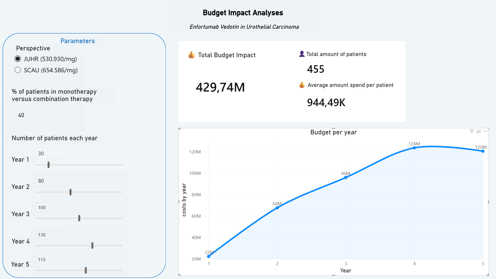

# Budget Impact Model – Padcev (enfortumab vedotin)
## Urothelial carcinoma | Czech payer perspective | 5-year horizon

An interactive model of the 5-year budget impact on a Czech payer's when reimbursing enfortumab vedotin. The project combines a Python-based patient population simulation with an interactive Power BI dashboard.

## Objective

Estimate the 5-year impact on public health insurance spending from
reimbursing enfortumab vedotin, with the ability to interactively change
key assumptions:
1. price
   * JUHR = Jádrová úhrada/core reimbursement is amount that the public health insurance system reimburses
   *  UHR = JUHR + pharmacy/distribution margin + VAT
2. % of patinets in monotherapy vs combination therapy
3. population size each year.

## Key features

- **Monte Carlo simulation of patient weight** (10,000 patients, lognormal
  distribution) – dosing is weight-based (1.25 mg/kg), so a realistic
  estimate of consumption and drug wastage is required.
- **Drug wastage modelling** – because the dose is rounded up to the vial
  size (20/30 mg), wastage is computed per patient. The mean of rounded
  doses ≠ the rounding of the mean dose (Jensen's inequality), which is why
  the model simulates a population instead of using an "average patient".
- **Two treatment regimens** – monotherapy (2nd line) and combination with
  pembrolizumab (1st line), with an adjustable share of patients.
- **Treatment carry-over coefficient between years** – treatment started in
  a given year often extends into the next; the model splits the cost using
  the coefficient 1 − D/730 (D = median treatment duration in days).
- **What-if parameters** – price per mg, regimen mix, population size, and the uptake curve.

## Methodology

1. **Dose per patient**: required dose = min(weight × 1.25, 125) mg;
   prepared dose = rounded up to nearest 10 mg (min. 20 mg).
2. **Wastage**: prepared dose − required dose (in mg).
3. **Administrations per course**: (treatment duration / cycle length) ×
   administrations per cycle. Monotherapy ≈ 16; combination ≈ 18.
4. **Patients treated per year**: eligible patients × uptake rate.
5. **Carry-over between years**: share of a course falling in the starting
   year = 1 − D/730; the remainder falls into the following year.
6. **Annual cost** = treated patients × prepared dose × administrations ×
   price per mg, split across years via the carry-over coefficient.

## Data sources

- **Price**: SÚKL (State Institute for Drug Control) – reimbursement
  proceeding SUKLS325499/2024.
- **Dosing**: Padcev Summary of Product Characteristics (SmPC), section 4.2.
- **Eligible population**: SÚKL assessment-report summary (113–188 patients/year).
- **Treatment duration**: clinical trials EV-302 (combination) and
  EV-301 (monotherapy).

## Limitations

- Fixed 5-year window: treatment started in year 5 and extending into year 6
  is counted only up to its year-5 consumption.
- Uptake curve is an assumption and should ideally be sourced from the
  SÚKL assessment report.
- Price perspective is adjustable (payer reimbursement vs. price including VAT).

## Tools

Python (NumPy, pandas) for the population simulation · Power BI for the
interactive dashboard and what-if parameters.
